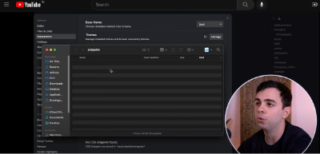

# Information

This repository is an Obsidian vault that demonstrates using the Dashboard++ method for organizing and navigating notes. For further details, see this article for a detailed description:

- [Dashboard++ — a simple organization and navigation method for Obsidian Vaults](https://tfthacker.medium.com/dashboard-a-simple-organization-and-navigation-method-for-obsidian-vaults-2b1982d023a0)

You can find me on Twitter https://tfthacker.com.

Or better yet, watch a video on how to install this from Sergio:

# 2023 Obsidian Gems award for templates

Dashboard++ won the "2023 Obsidian Gem of the year" in the templates category. Thank you to all of you who voted for this template!

- Read more at the Official Obsidian blog: [2023 Gems of the year winners](https://obsidian.md/blog/2023-goty-winners/)

## Ways to connect with me and more information on my work

You might also be interested in a few products I have made for Obsidian:

- [Canvas Candy](https://tfthacker.com/canvas-candy) - The Canvas Candy Vault is a set of tools specially designed for use with the canvas feature of Obsidian. With over 40+ decorations, you can add new dimensions to the cards on your canvas.

- [Cornell Notes Learning Vault](https://tfthacker.com/cornell-notes) - This vault teaches you how to use the Cornell Note-Taking System in your Obsidian vault. It includes learning material, samples, and Obsidian configuration files to enable Cornell Notes in your vault.

You can find me on Twitter [@TfTHacker](https://twitter.com/TfTHacker)

My website https://tfthacker.com/
